# Introduction
The purpose of this project is to carry out clinical text mining to enable us to predict medical specialities required from a transcript of a patient's visit to the hospital.

# Project flow chart.

```mermaid
flowchart TD
    A["Raw Clinical Transcription Dataset<br/>Total shape: 4999, 5<br/>Number of specialities: 40"] --> B["Data Preprocessing<br/>Dropping the NAs from the transcript<br/>Strip whitespace from the medical speciality column"]
    B --> C{"Decision Point:<br/>How to handle 40 classes?<br/>How to deal with the high class imbalance"}
    C -->|Path 1| D["Filter to specialties<br/>with 100+ records<br/>(~12 classes, keep granularity)"]
    C -->|Path 2| E["Dimensionality reduction:<br/>group into 4-5<br/>broad categories"]

    D --> D_pre["Clinical Text Preprocessing<br/>Stopword removal, stemming,<br/>lemmatization, tokenization, etc."]
    E --> E_pre["Clinical Text Preprocessing<br/>Stopword removal, stemming,<br/>lemmatization, tokenization, etc."]

    subgraph Path1["Path 1 — Fine-Grained (12 Classes)"]
        direction LR
        subgraph P1_A["George obanda — TF-IDF"]
            direction TB
            TI_D[TF-IDF Vectorization]
            TI_D_svc[Linear SVC]
            TI_D_lr[Multinomial Logistic Regression]
            TI_D --> TI_D_svc
            TI_D --> TI_D_lr
        end
        subgraph P1_B["Simon Kimazi — GloVe"]
            direction TB
            GV_D[GloVe Embeddings]
            GV_D_svc[Linear SVC]
            GV_D_lr[Multinomial Logistic Regression]
            GV_D --> GV_D_svc
            GV_D --> GV_D_lr
        end
        subgraph P1_C["Godwin Mutai — Word2Vec"]
            direction TB
            WV_D[Word2Vec Embeddings]
            WV_D_svc[Linear SVC]
            WV_D_lr[Multinomial Logistic Regression]
            WV_D --> WV_D_svc
            WV_D --> WV_D_lr
        end
        subgraph P1_D["Clement Mwagwabi — FastText"]
            direction TB
            FT_D[FastText Embeddings]
            FT_D_svc[Linear SVC]
            FT_D_lr[Multinomial Logistic Regression]
            FT_D --> FT_D_svc
            FT_D --> FT_D_lr
        end
    end

    subgraph Path2["Path 2 — Broad Categories (4-5 Classes)"]
        direction LR
        subgraph P2_A["George Obanda — TF-IDF"]
            direction TB
            TI_E[TF-IDF Vectorization]
            TI_E_svc[Linear SVC]
            TI_E_lr[Multinomial Logistic Regression]
            TI_E --> TI_E_svc
            TI_E --> TI_E_lr
        end
        subgraph P2_B["Simon Kimanzi — GloVe"]
            direction TB
            GV_E[GloVe Embeddings]
            GV_E_svc[Linear SVC]
            GV_E_lr[Multinomial Logistic Regression]
            GV_E --> GV_E_svc
            GV_E --> GV_E_lr
        end
        subgraph P2_C["Godwin Mutai — Word2Vec"]
            direction TB
            WV_E[Word2Vec Embeddings]
            WV_E_svc[Linear SVC]
            WV_E_lr[Multinomial Logistic Regression]
            WV_E --> WV_E_svc
            WV_E --> WV_E_lr
        end
        subgraph P2_D["Clement Mwagwabi — FastText"]
            direction TB
            FT_E[FastText Embeddings]
            FT_E_svc[Linear SVC]
            FT_E_lr[Multinomial Logistic Regression]
            FT_E --> FT_E_svc
            FT_E --> FT_E_lr
        end
    end

    D_pre --> TI_D
    D_pre --> GV_D
    D_pre --> WV_D
    D_pre --> FT_D

    E_pre --> TI_E
    E_pre --> GV_E
    E_pre --> WV_E
    E_pre --> FT_E

    TI_D_svc --> H["Evaluate Path 1:<br/>macro-F1, confusion matrix, CV"]
    TI_D_lr --> H
    GV_D_svc --> H
    GV_D_lr --> H
    WV_D_svc --> H
    WV_D_lr --> H
    FT_D_svc --> H
    FT_D_lr --> H

    TI_E_svc --> I["Evaluate Path 2:<br/>macro-F1, confusion matrix, CV"]
    TI_E_lr --> I
    GV_E_svc --> I
    GV_E_lr --> I
    WV_E_svc --> I
    WV_E_lr --> I
    FT_E_svc --> I
    FT_E_lr --> I

    H --> J{"Compare Path 1 vs Path 2:<br/>fine-grained accuracy vs<br/>broader-category robustness"}
    I --> J
    J --> K[Select best approach]

    classDef personA fill:#cde4ff,stroke:#3f7fd6,stroke-width:1px,color:#1a1a1a;
    classDef personB fill:#d4f4dd,stroke:#3fb26a,stroke-width:1px,color:#1a1a1a;
    classDef personC fill:#ffe3c2,stroke:#e08a2c,stroke-width:1px,color:#1a1a1a;
    classDef personD fill:#f0d4f7,stroke:#a355bf,stroke-width:1px,color:#1a1a1a;

    class TI_D,TI_D_svc,TI_D_lr,TI_E,TI_E_svc,TI_E_lr personA;
    class GV_D,GV_D_svc,GV_D_lr,GV_E,GV_E_svc,GV_E_lr personB;
    class WV_D,WV_D_svc,WV_D_lr,WV_E,WV_E_svc,WV_E_lr personC;
    class FT_D,FT_D_svc,FT_D_lr,FT_E,FT_E_svc,FT_E_lr personD;

    style Path1 fill:#f8f9fa,stroke:#666,stroke-width:2px
    style Path2 fill:#f8f9fa,stroke:#666,stroke-width:2px
    style P1_A fill:#eaf3ff,stroke:#3f7fd6,stroke-width:1px
    style P1_B fill:#eafaf0,stroke:#3fb26a,stroke-width:1px
    style P1_C fill:#fff4e8,stroke:#e08a2c,stroke-width:1px
    style P1_D fill:#faedfc,stroke:#a355bf,stroke-width:1px
    style P2_A fill:#eaf3ff,stroke:#3f7fd6,stroke-width:1px
    style P2_B fill:#eafaf0,stroke:#3fb26a,stroke-width:1px
    style P2_C fill:#fff4e8,stroke:#e08a2c,stroke-width:1px
    style P2_D fill:#faedfc,stroke:#a355bf,stroke-width:1px
```
